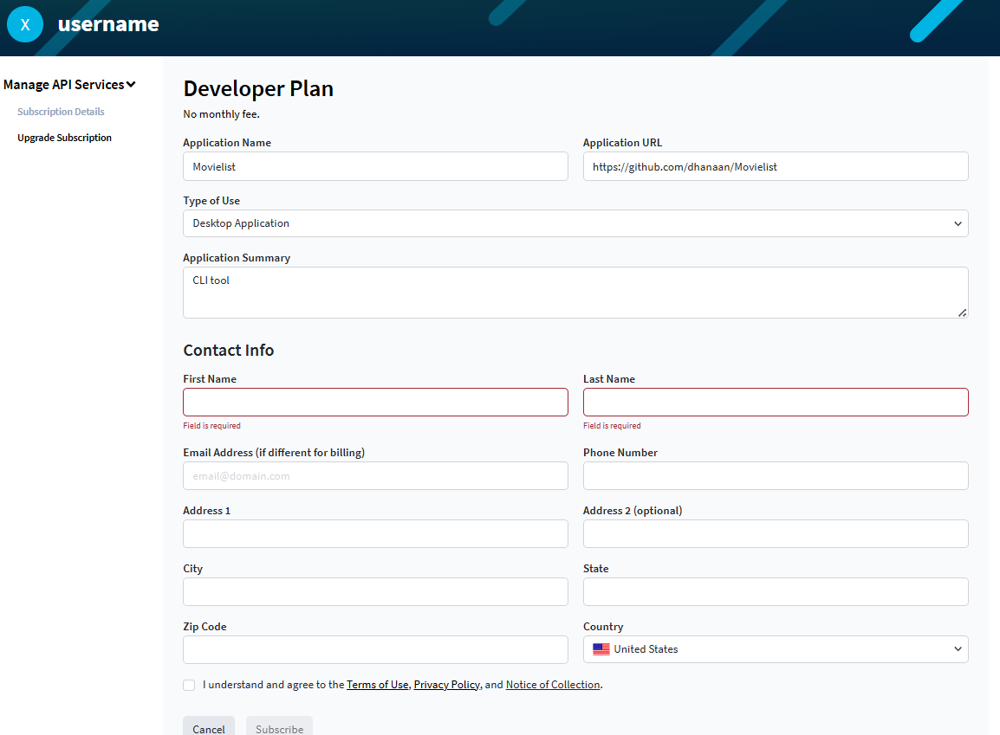

# Getting Your TMDB Access Token

Movielist needs a **TMDB API Read Access Token** to fetch movie data. It's free, TMDB will never charge you for this.

## Steps

1. **Sign up or log in** to [TMDB](https://themoviedb.org).
2. Click your profile picture (top right) → **Settings** → **API**.
3. Click **+ Create** next to "Overview".
4. Select **"This is for my own personal use only"**.
5. Fill out the developer form:

   

   | Field | Value |
   |---|---|
   | Application Name | `Movielist` |
   | Application URL | `https://github.com/dhanaan/Movielist` |
   | Type of Use | `Desktop Application` |
   | Application Summary | `CLI tool` |
   | Contact Info | Your own info (no verification, just fill it in) |

6. Click **Subscribe** at the bottom (this is a free subscription, no payment involved)
7. Go to your profile → **API Subscription**.
8. Click **"Access your API key details here"** and copy your **full API Read Access Token** (⚠️ not the "API Key", the longer one).
9. Paste the token into Movielist. You're done!